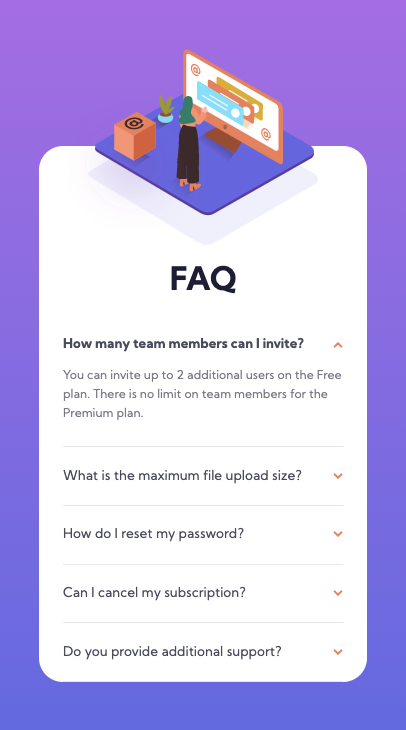

# Frontend Mentor - FAQ accordion card solution

This is my solution to the [FAQ accordion card challenge on Frontend Mentor](https://www.frontendmentor.io/challenges/faq-accordion-card-XlyjD0Oam). It's my first time working on a project with Javascript! :tada: Any feedback is appreciated. :relaxed:

### The challenge

Users should be able to:

- View the optimal layout for the component depending on their device's screen size
- See hover states for all interactive elements on the page
- Hide/Show the answer to a question when the question is clicked

### Screenshot

   
   

### Links

- Solution URL: [https://www.frontendmentor.io/solutions/faq-accordion-card-mKPUGhsYV](https://www.frontendmentor.io/solutions/faq-accordion-card-mKPUGhsYV)
- Live Site URL: [https://ellieroy.github.io/faq-accordion-card/](https://ellieroy.github.io/faq-accordion-card/)

### Built with

- Semantic HTML5 markup
- CSS custom properties
- Flexbox
- CSS Grid
- Vanilla Javascript

## Author

- Frontend Mentor - [@ellieroy](https://www.frontendmentor.io/profile/ellieroy)

## Acknowledgments

I used Coder Coder's live coding [video on Youtube](https://www.youtube.com/watch?v=FboXxLxg8eo) and Ana Luz Cervantes's [solution](https://www.frontendmentor.io/solutions/faq-accordion-card-PCZJIKBwk) as references for my own solution. Thanks for sharing!

