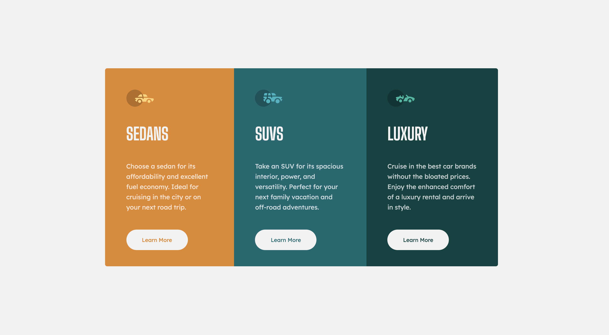
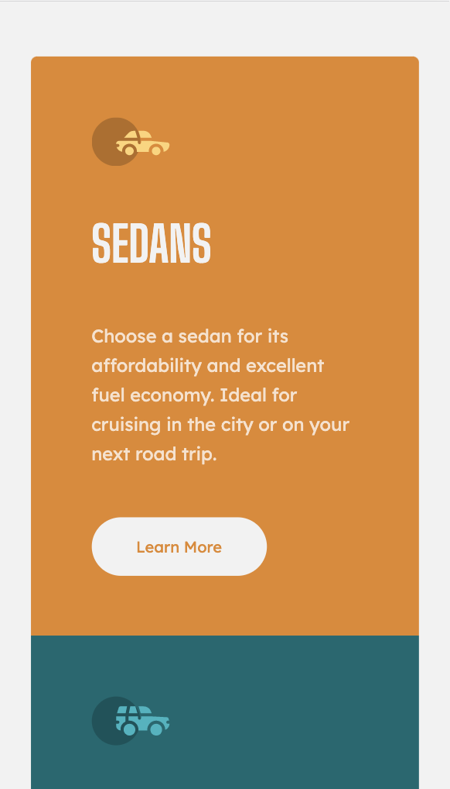

# Frontend Mentor - 3-column preview card component solution

This is my solution to the [3-column preview card component challenge on Frontend Mentor](https://www.frontendmentor.io/challenges/3column-preview-card-component-pH92eAR2-). Any feedback is appreciated. :relaxed:

### The challenge

Users should be able to:

- View the optimal layout depending on their device's screen size
- See hover states for interactive elements

### Screenshot

   
   

### Links

- Solution URL: [https://www.frontendmentor.io/solutions/3column-preview-card-component-lfrH2DqDE](https://www.frontendmentor.io/solutions/3column-preview-card-component-lfrH2DqDE)
- Live Site URL: [https://ellieroy.github.io/3-column-card/](https://ellieroy.github.io/3-column-card/)

### Built with

- Semantic HTML5 markup
- CSS custom properties
- Flexbox
- CSS Grid

# Author

- Frontend Mentor - [@ellieroy](https://www.frontendmentor.io/profile/ellieroy)