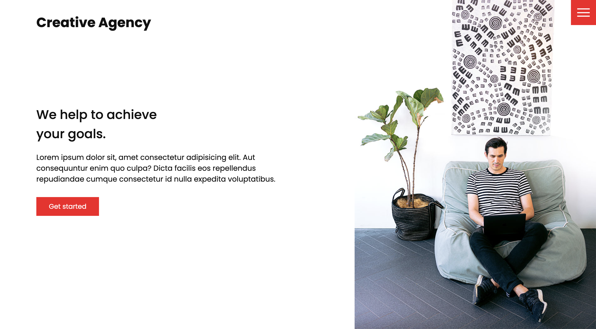

# Traversy Media - Creative agency website

This is a website for a pretend creative agency that I created by following [this tutorial](https://www.youtube.com/watch?v=lvYnfMOUOJY&t=86s) by Traversy Media. 

### Screenshot

   
   

### Links
- Live site URL: [https://ellieroy.github.io/creative-agency-website/](https://ellieroy.github.io/creative-agency-website/)

### Built with 
- Semantic HTML5 markup
- CSS custom properties
- Flexbox
- CSS Grid

## Acknowledgements 
I followed the tutorial created by [Traversy Media](https://www.youtube.com/watch?v=lvYnfMOUOJY&t=86s) in order to create this website. Thanks for sharing!
